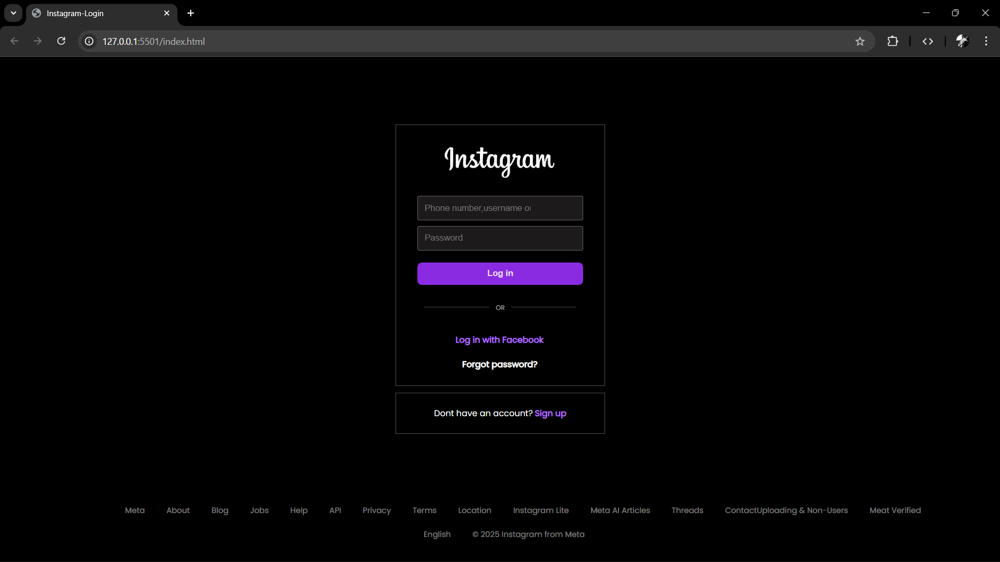

# 📸 Instagram Login Page Clone

A simple **Instagram Login Page Clone** built using **HTML and CSS**.  
This project recreates the look and feel of Instagram’s login interface using clean, responsive styling.

---

## 🧠 Features

- Responsive and minimalist UI  
- Styled with pure CSS — no frameworks used  
- Clean layout similar to Instagram’s real login page  
- Interactive hover effects for links and buttons  
- Footer links styled for authentic look and alignment  

---

## 🛠️ Technologies Used

- **HTML5**  
- **CSS3 (Flexbox & Styling)**  
- **Google Fonts (Poppins)**  

---

## 🌐 Live Preview

> ## 📸 Website Preview

---
